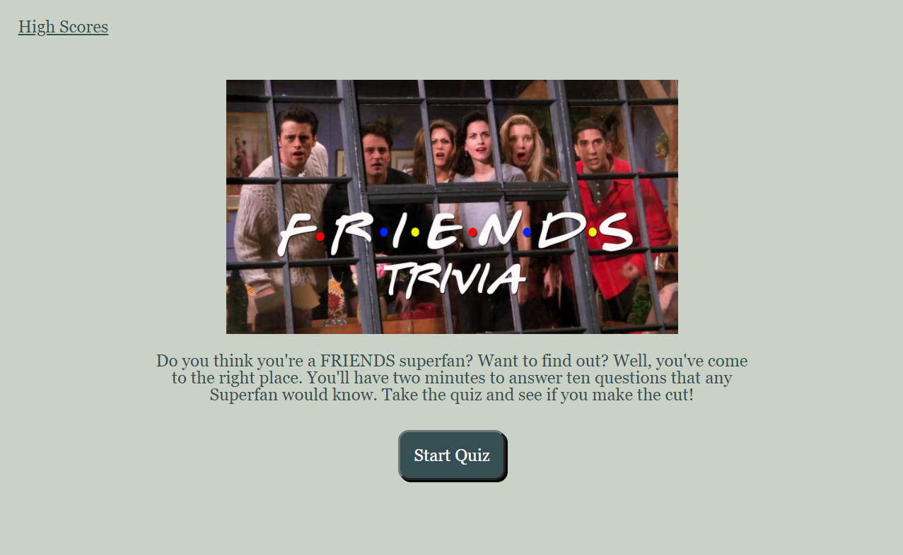

# 04 JavaScript: Quiz

## Summary

Are you a Friends series superfan? This quiz is designed to find out! You have two minutes to answer ten questions. If you miss a question, you'll lose ten seconds off the clock. If the time runs down to zero, you won't be able to make the leaderboard. If you can answer all ten questions, you'll find out if you really are a superfan!

## Key Features

Key features of the quiz include:

* Link to High Scores html page from the start page
* Each time the quiz is run, the quiz questions will be shuffled
* Once the quiz has been started, the View Scores link is replaced with a Restart Quiz link
* Dynamically created question and answer buttons for each quiz question
* Even listeners for each button that:
    * Check if you selected the right question
    * If the right answer is selected, "Correct!" will pop up below
    * If the wrong answer is selected, "Incorrect" and the right answer will pop up
    * Once an answer has been selected, the buttons are disabled
    * A Next Question button is created
    * The buttons, right/wrong answer pop-up and Next button are removed
    * The function that creates the buttons is run again until it reaches the last question
* A timer that's decremented if the user gets an answer wrong
* Based on your score, the quiz will evalute how much of a Friends fan you are
* Leaderboard for the top five scores, in decending order
* Fun Friends pictures throughout the quiz

## Link to Deploy

[Friends Trivia Quiz: Are You A Superfan?](https://leighdahlin.github.io/leigh-dahlin-homework4/)

## Screenshot

